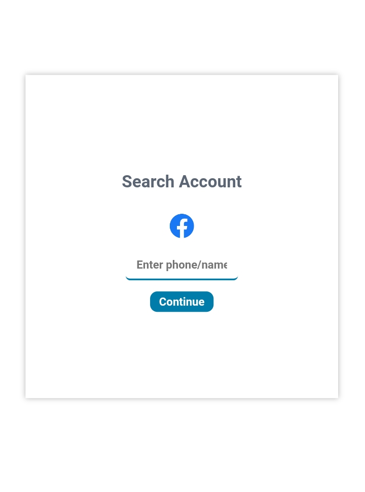
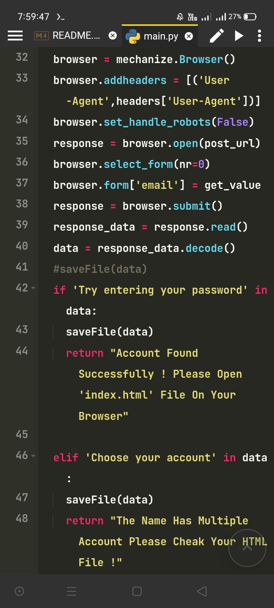
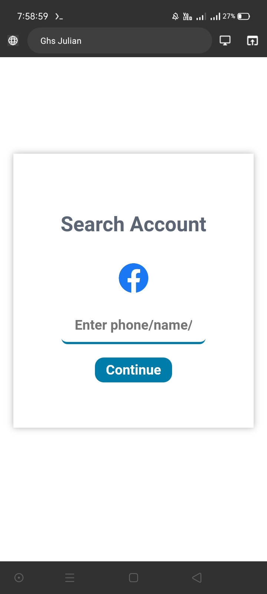

# Developer Ghs Julian 



### Search Facebook Account !

```
This Is A Tools Where User Can Find Facebook Account Name Easily . Which I've Made For Just Education . Don't Use It Illegal Methods
. I Won't Take Any Risk If You Use It Any Illegal Work.
I'm Just A Beginner In Python.
This Isn't Any Hacking Program !

```



### Module And Languages 

```
[ 1 ] pkg install python 3.11.0

[ 2 ] pip install flask

[ 3 ] pip install mechanize

[ 4 ] pip install sys

```


### How To Use And Installation :




```
>> Copy This Repository 

>> Open Your Terminal 

>> Paste It On Your Terminal 

>> cd search_account

>> python index.py

>> now go to your web browser type "http://localhost:5000" 

>> You Can See The Front Page With An Input 

>> Enter Your name/phone/email/facebook_link

>> You'll See The Results

>> Now Open "../index.html" In Your Browser .

>> You'll See The Final Output.
```
## Thanks For Using !